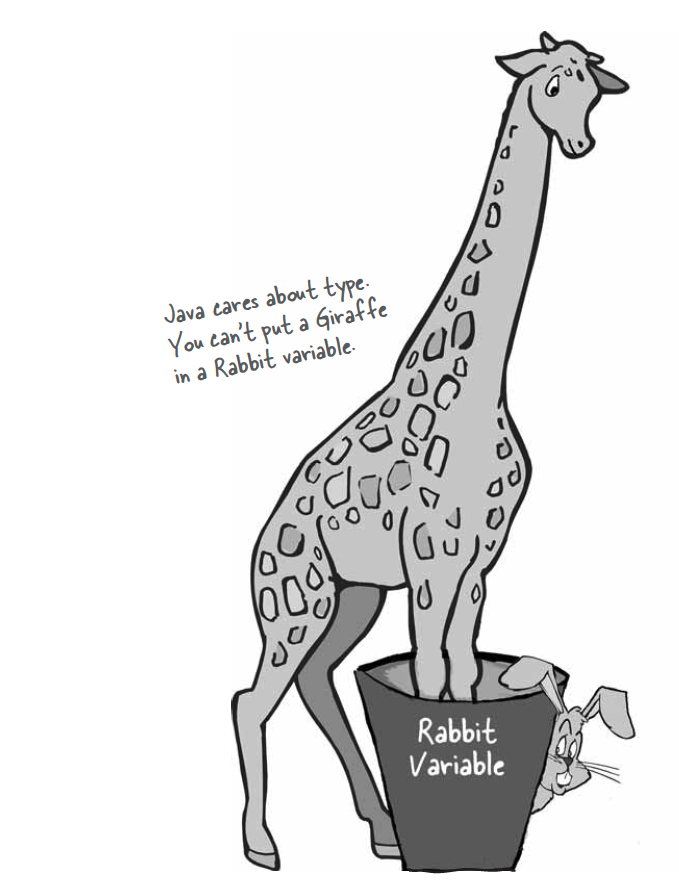
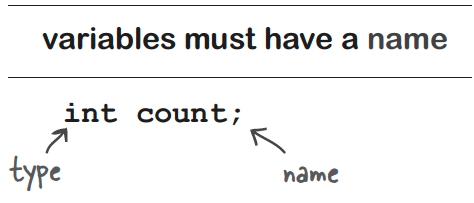
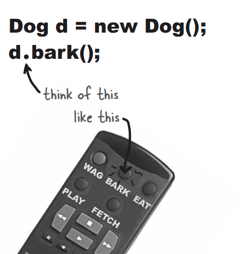
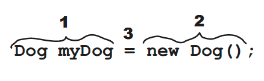
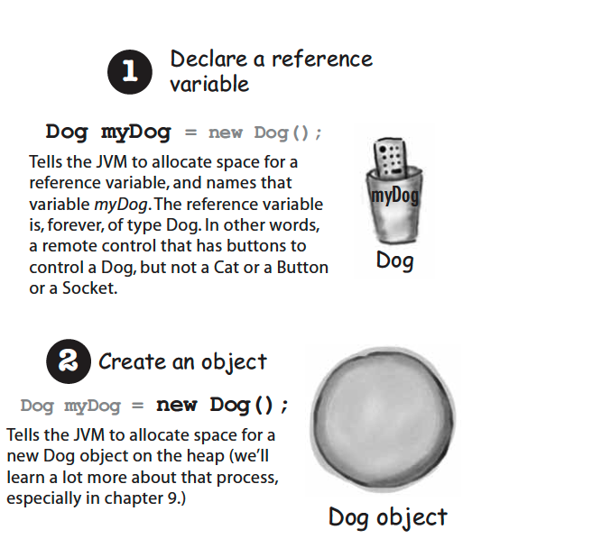
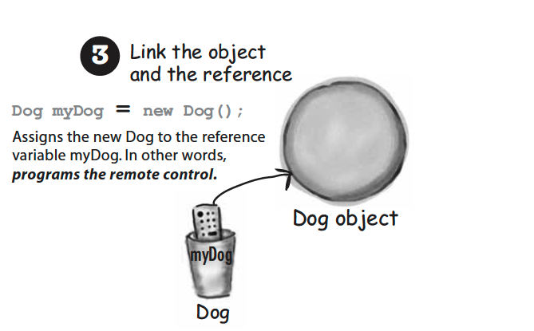
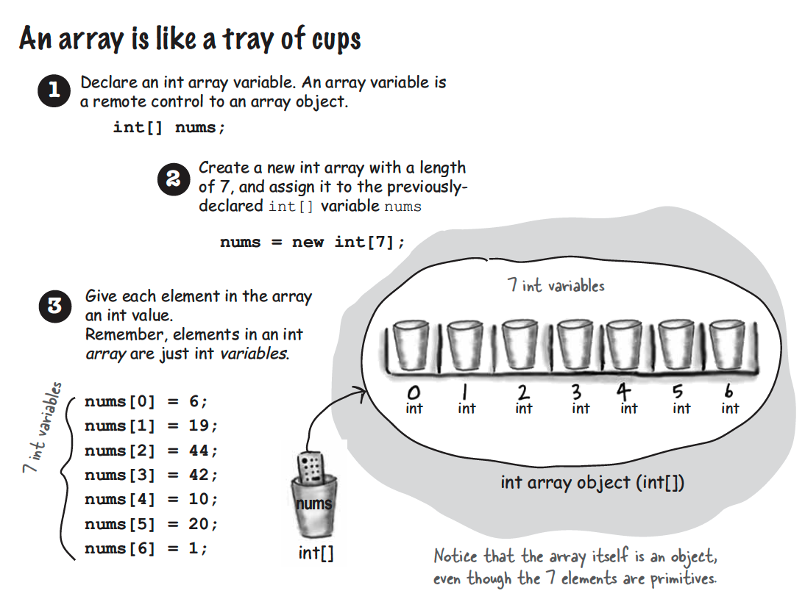
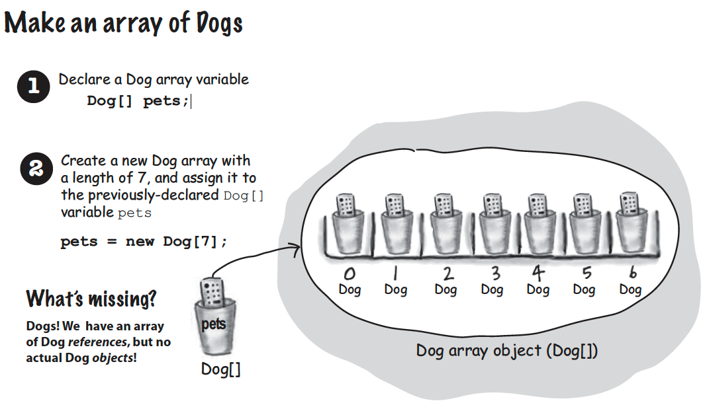
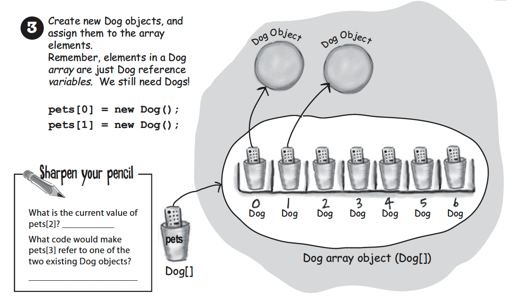

# Know your Variables

## Declaring a Variable

**Java cares about type.** It wont let you do something bizarre and dangerous like stuff a Giraffe reference into a Rabbit variable - what happens when someone tires to ask the so-called rabbit to hop()? And it won’t let you but a floating point number into an integer variable, unless you acknowledge to the compiler that you know you might lose precision (like, everything after the decimal point).

The compiler can spot most common problems:

```
Rabbit roger = new Giraffe();
```



### Variables must have a type



When you see a statement like: " an object of **type X** ", think of type and class as synonyms.

## Where my dawgs at?

How do we create a custom object?

* There is actually no such thing as an object variable.
* There's only an object reference variable.
* An object refference variable holds bits that represent a way to access an object.
* It doesn't hold the object itself, but it holds something like a pointer. Or an address. Except, in Java we don't really know what is inside a reference variable. We do know that whatever it is, it represents one and only one object. And the JVM knows how to use the reference to get the object.



Think of a Dog reference variable as a Dog remote control. You use it to get the object to do something. (invoke methods/behaviors )

```
Dog snoopy = new Dog();
snoopy.bark();

```

## The 3 steps of object declaration, creation and assignment







## Arrays





# MyFirstTDD
* **Objective:**
    * To create tests that ensure expected behavior of each class:
        * Cat
        * Dog
        * AnimalFactory
        * CatHouse
        * DogHouse
* **Purpose:**
    * To establish familiarity with Test-Driven-Development (TDD) practices.
* **Getting context:**
	* Click [here](README-TDDPatterns.md) to gain more familiarity with TDD-structured programming.

### CatTest
* Create tests for `void setName(String name)`
    * ensure that when `.setName` is invoked on an instance of `Cat`, the `name` field is being set to the respective value.
* Create tests for `setBirthDate(Date birthDate)`
    * ensure that when `.setBirthDate` is invoked on an instance of `Cat`, the `birthDate` field is being set to the respective value.
* Create tests for `String speak()`
    * ensure that when `.speak` is invoked on an instance of `Cat`, the value `"meow!"` is returned.
* Create tests for `void eat(Food food)`
    * ensure that when `.eat` is invoked on an instance of `Cat`, the `numberOfMealsEaten` is increased by 1.
* Create tests for `Integer getId()`
    * ensure that when `.getId` is invoked on an instance of `Cat`, the respective `id` value is returned.
* Create test to check Animal inheritance; google search `java instanceof keyword`
    * ensure that a `Cat` is an `instanceof` an Animal 
* Create test to check Mammal inheritance; google search `java instanceof keyword`
    * ensure that a `Cat` is an `instanceof` a Mammal

### DogTest
* Create tests for `void setName(String name)`
    * ensure that when `.setName` is invoked on an instance of `Dog`, the `name` field is being set to the respective value.
* Create tests for `setBirthDate(Date birthDate)`
    * ensure that when `.setBirthDate` is invoked on an instance of `Dog`, the `birthDate` field is being set to the respective value.
* Create tests for `String speak()`
    * ensure that when `.speak` is invoked on an instance of `Dog`, the value `"bark!"` is returned.
* Create tests for `void eat(Food food)`
    * ensure that when `.eat` is invoked on an instance of `Dog`, the `numberOfMealsEaten` is increased by 1.
* Create tests for `Integer getId()`
    * ensure that when `.getId` is invoked on an instance of `Dog`, the respective `id` value is returned.
* Create test to check Animal inheritance; google search `java instanceof keyword`
    * ensure that a `Dog` is an `instanceof` an Animal 
* Create test to check Mammal inheritance; google search `java instanceof keyword`
    * ensure that a `Dog` is an `instanceof` an Mammal
 

### AnimalFactoryTest
* Create Test for `Animal createDog(String name, Date birthDate)`
    * ensure that when `.createDog` is invoked on `AnimalFactoryTest` a `Dog` is created with the respective `name` and `birthDate` value.
* Create Test for `Animal createCat(String name, Date birthDate)`
    * ensure that when `.createCat` is invoked on `AnimalFactoryTest` a `Dog` is created with the respective `name` and `birthDate` value.

### CatHouseTest
* Create tests for `void add(Cat cat)`
    * ensure that when `.add` is invoked on the `CatHouse`, a respective `Cat` object can be retrieved from the house.  
* Create tests for `void remove(Cat cat)`
    * ensure that when `.remove` is invoked on the `CatHouse`, a respective `Cat` object can no longer be retrieved from the house.
* Create tests for `void remove(Integer id)`
    * ensure that when `.remove` is invoked on the `CatHouse`, a `Cat` object with the respective `id` can no longer be retrieved from the house.
* Create tests for `Cat getCatById(Integer id)`
    * ensure that when `.getCatById` is invoked on the `CatHouse`, a `Cat` with the respective `id` is returned.
* Create tests for `Integer getNumberOfCats()`
    * ensure that when `.getNumberOfCats()` is invoked on the `CatHouse`, the respective number of `Cat` objects is returned.
 
### DogHouseTest
* Create tests for `void add(Dog dog)`
    * ensure that when `.add` is invoked on the `DogHouse`, a respective `Dog` object can be retrieved from the house.  
* Create tests for `void remove(Integer id)`
    * ensure that when `.remove` is invoked on the `DogHouse`, a respective `Dog` object can no longer be retrieved from the house.
* Create tests for `void remove(Dog dog)`
    * ensure that when `.remove` is invoked on the `DogHouse`, a `Dog` object with the respective `id` can no longer be retrieved from the house.
* Create tests for `Dog getDogById(Integer id)`
    * ensure that when `.getCatById` is invoked on the `DogHouse`, a `Dog` with the respective `id` is returned.
* Create tests for `Integer getNumberOfDogs()`
    * ensure that when `.getNumberOfDogs()` is invoked on the `DogHouse`, the respective number of `Dog` objects is returned.

